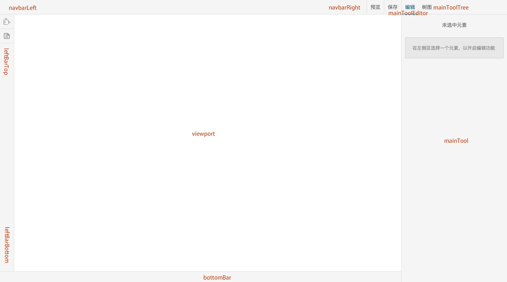

# custom plugin

`gaea-editor` has many built-in plug-ins, and it's also the best demo:

## UI plugins

- [save](../src/plugins/save/index.tsx)
- [preview](../src/plugins/preview/index.tsx)
- [page](../src/plugins/page/index.tsx)
- [main-tool](../src/plugins/main-tool/index.tsx)
- ...

## Editor type plugins

- [string](../src/plugins/main-tool-editor-type-string/index.tsx)
- [number](../src/plugins/main-tool-editor-type-number/index.tsx)
- [boolean](../src/plugins/main-tool-editor-type-boolean/index.tsx)
- [color](../src/plugins/main-tool-editor-type-color/index.tsx)
- ...

## Features

- use `Connect` decorator from 'dob-react', then you can access all [built-in stores and actions](../src/stores). [Demo](../src/plugins/main-tool-editor-type-string/index.tsx#L20).
- `gaea-editor` has some [built-in position](../src/page/page.component.tsx), and plugins can register positions by using `ApplicationAction.loadPluginByPosition(position: string)`.

## All built-in positions

