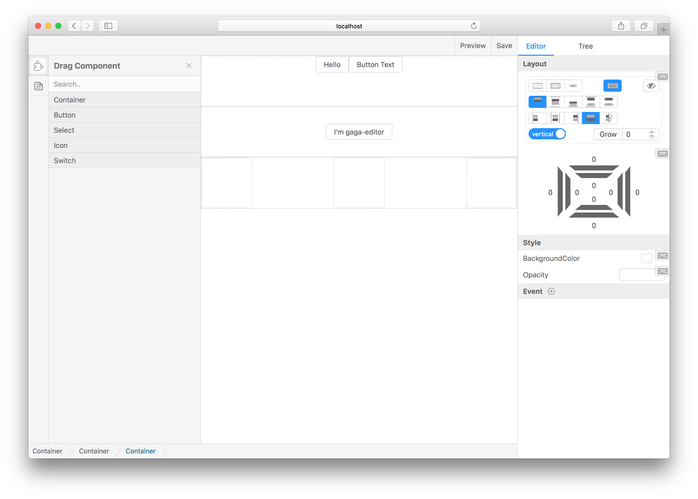
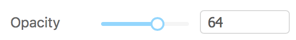
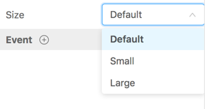
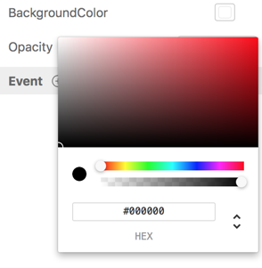
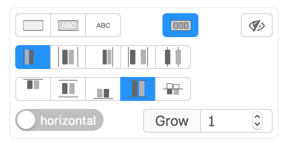
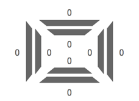
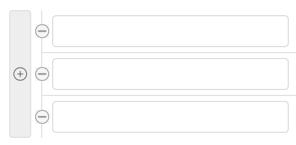
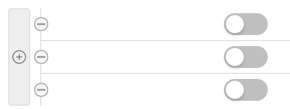
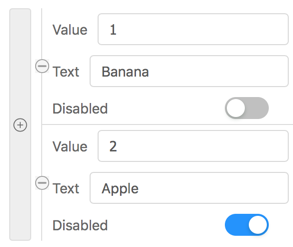
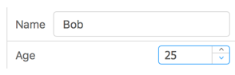

# Gaea Editor &middot; [](https://travis-ci.org/dobjs/dob) [](https://www.npmjs.com/package/dob) [](https://codecov.io/github/dobjs/dob)

<p align="center">
    
    <h3 align="center">gaea-editor</h3>
    <p align="center">
        <i>
            Help develops build a scalable website visualization builder.
        </i>
    <p>
    <p align="center">
        <i>
            <a target="_blank" href="https://gaeajs.github.io/gaea-site/">Try it online.</a>
        </i>
    </p>
</p>

## Quick start

```bash
npm i gaea-editor --save
```

And then, it's easy to use:

```typescript
import Editor from 'gaea-editor';

ReactDOM.render(
  <div style={{ width: '100vw', height: '100vh' }}>
    <Editor />
  </div>,
  document.getElementById('react-root')
);
```

- For vue - [gaea-editor-vue](https://github.com/CharlieLau/gaea-editor-vue), thanks [CharlieLau](https://github.com/CharlieLau).

## Add custom component to the drag menu

You can add any react components to the drag menu, through the following line of code:

```typescript
import BasicComponents from 'gaea-basic-components';
<Editor componentClasses={[...BasicComponents, CustomComponent1, CustomComponent2]} />;
```

> `BasicComponents` support `container`, `button`, `icon`, `select`, `switch`. And there must be at least one component to set `isContainer=true` that can be used as outer container.
>
> Generally speaking, with `BasicComponents` concat is ok, because the component `container` `BasicComponents` offered is a container.

Add `editSetting` to each component props, to let the editor know how to edit it visualizations:

```typescript
defaultProps = {
  editSetting: {
    key: 'my-custom-key', // Unique key.
    name: 'Custom one', // The name shown in drag menu.
    isContainer: false, // Can be dragged in.
    editors: [
      {
        field: 'title',
        text: 'Text',
        type: 'string'
      }
    ] // Tell gaea-editor, which props can be edited and how to edit it.
  }
};
```

## More about `editors`

gaea-editor provides several built-in type editing props. If you need to expand it, you can refer to [custom plugin](./docs/custom-plugin.md).

common field:

- `field`: which props to edit. EX: `value` `visible` `style.backgroundColor`.
- `text`: If exist, will appear in the form label to prompt the user.

The following are the built-in types:

### string


Suitable for any string editing scene.

```typescript
{
    type: 'string',
    text: 'Text',
    field: 'value'
}
```

### number



Suitable for any number editing scene.

In many cases, it is suggested that `inputRange` and `outputRange` be set to the same value.

```typescript
{
    type: 'number',
    text: 'Text',
    field: 'value',
    data: {
        useSlider: true,
        step: 1,
        inputRange: [0, 100],
        outputRange: [0, 1]
    }
}
```

### boolean


Suitable for any boolean editing scene.

```typescript
{
    type: 'boolean',
    text: 'Checked',
    field: 'value'
}
```

### select



Suitable for enumable editing scene.

```typescript
{
    type: 'select',
    text: 'Text',
    field: 'value',
    data: [{
        text: 'Default',
        value: 0
    }, {
        text: 'Small',
        value: 1
    }, {
        text: 'Large',
        value: 2
    }]
}
```

### color



Suitable for color picker editing scene.

```typescript
{
    type: 'color',
    text: 'Text',
    field: 'style.backgroundColor',
}
```

### display



Suitable for layout editing scene.

Because this type will edit multiple props properties, such as `style.display` `style.flexDirection`, so don't need to specify the `field` field.

```typescript
{
    type: 'display',
    text: 'Text'
}
```

### box-editor



Suitable for margin-padding editing scene.

Because this type will edit multiple props properties, such as `margin` `padding`, so don't need to specify the `field` field.

```typescript
{
    type: 'box-editor',
    text: 'Text'
}
```

### array



**Super type**, allow visualizations to edit a array type props.

```typescript
{
    type: 'array',
    text: 'values',
    data: 'string'
}
```

You can change `string` to `boolean`, than it can edit boolean array:



### object array



**Super type**, allow visualizations to edit a array type props.

Each field in `data` describes how the key should be edited in the object in array.

> Each field in `data` is a `editor` type. You can even nested `array` or `object` type inside.

```typescript
{
    type: 'array',
    text: 'Options',
    data: [{
        field: "value",
        type: "string",
        text: "Value"
    }, {
        field: "text",
        type: "string",
        text: "Text"
    }, {
        field: "disabled",
        type: "boolean",
        text: "Disabled"
    }]
}
```

### object



**Super type**, allow visualizations to edit a object type props.

Each field in `data` describes how the key should be edited in this object.

> Each field in `data` is a `editor` type. You can even nested `array` or `object` type inside.

```typescript
{
    type: 'object',
    text: 'Text',
    data: [{
        field: "name",
        type: "string",
        text: "Name"
    }, {
        field: "age",
        type: "number",
        text: "Age"
    }]
}
```

## Options

You can add custom components, custom plugins, save callback, and read saved data.

| Props            | Type                                      | Description                                                                                                                                                                                    |
| ---------------- | ----------------------------------------- | ---------------------------------------------------------------------------------------------------------------------------------------------------------------------------------------------- |
| onSave           | `(info?: string) => void`                 | When you click the Save button, feed back to you to save the information                                                                                                                       |
| defaultValue     | `object`                                  | Editor initial value, you can pass the value of the onSave callback and resume the draft                                                                                                       |
| componentClasses | `Array<React.ComponentClass<IGaeaProps>>` | React classes. Any react component is supported, but you need some configuration information to tell the editor how to edit it. see [custom-component-config](docs/custom-component-config.md) |
| plugins          | `IPlugin[]`                               | Advanced usage for custom editor functionality.                                                                                                                                                |
| locale           | string                                    | `zh` or `cn`                                                                                                                                                                                   |
| ViewportRender   | React.ReactElement\<any\>                 | You can rewrite viewport element.                                                                                                                                                              |

## Parameter: `onSave`

```typescript
export function renderGaeaEditor() {
  return (
    <Editor
      onSave={value => {
        // send the value data to your server.
      }}
    />
  );
}
```

## Parameter: `value`

The `value` came from `onSave`.

```typescript
export function renderGaeaEditor() {
  return <Editor value={value} />;
}
```

## Parameter: `componentClasses`

```typescript
class MyInput extends React.Component {
  render() {
    return <input />;
  }
}

export function renderGaeaEditor() {
  return <Editor componentClasses={[MyInput]} />;
}
```

> [LiveDemo](https://jsfiddle.net/47rpn9ud/2/)

Read more in [custom-component-config](docs/custom-component-config.md).

## Parameter: `plugins`

First you should install `dob-react`.

```bash
npm i dob-react
```

```typescript
import { Connect } from 'dob-react'

@Connect
class Plugin extends React.Component {
  render() {
  	return 'plugin'
  }
}

const plugin {
  position: "mainToolEditorTypeShow",
  class: ShowEditor
}

export function renderGaeaEditor() {
    return (
        <Editor plugins={[ Plugin ]}/>
    )
}
```

> [CustomEditTypeLiveDemo](https://jsfiddle.net/kq935dbq/3/)

What is `position`? What can i do with plugin? See more in [custom-plugin](docs/custom-plugin.md)

# Communication

Talk to us about gaea-editor using DingDing.


# Local development run

```bash
git clone https://github.com/ascoders/gaea-editor.git
cd gaea-editor
npm i
npm run docs
```

Will automatically open the default browser.

# Deploy

Step 1, get value by `onSave` method in `gaea-editor`:

```tsx
import Editor from 'gaea-editor';

ReactDOM.render(<Editor onSave={value => saveToServer(value)} />, document.getElementById('react-root'));
```

step 2, install `gaea-render`, and pass value to it:

```bash
npm i gaea-render
```

```tsx
import Render from 'gaea-render';

const value = getValueFromServer(); // <Editor onSave={value => // From here. } />

ReactDOM.render(<Render value={value} />, document.getElementById('react-root'));
```

## Custom component

By default, both `gaea-editor` and `gaea-render` using `gaea-basic-components`. You can overwrite it by these code:

```tsx
import Editor from 'gaea-editor';
import Render from 'gaea-render';

ReactDOM.render(<Editor componentClasses={myCustomComponents} />, document.getElementById('react-editor'));
ReactDOM.render(<Render componentClasses={myCustomComponents} />, document.getElementById('react-render'));
```

Or `concat` `gaea-basic-components`:

```tsx
import Editor from 'gaea-editor';
import Render from 'gaea-render';
import BasicComponents from 'gaea-basic-components';

ReactDOM.render(
  <Editor componentClasses={[...BasicComponents, myCustomComponents]} />,
  document.getElementById('react-editor')
);
ReactDOM.render(
  <Render componentClasses={[...BasicComponents, myCustomComponents]} />,
  document.getElementById('react-render')
);
```
